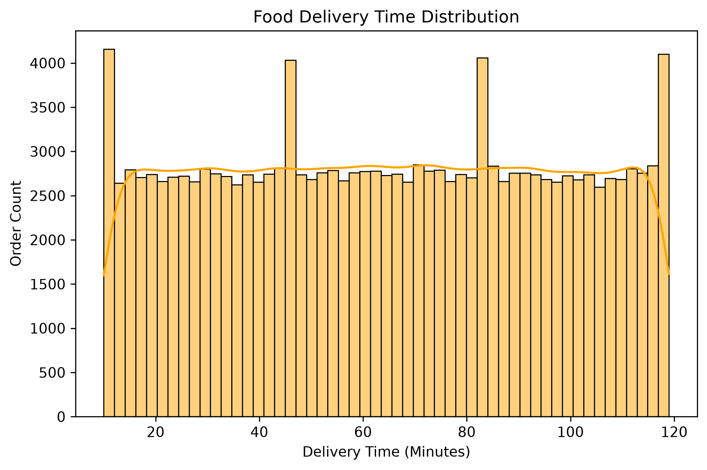
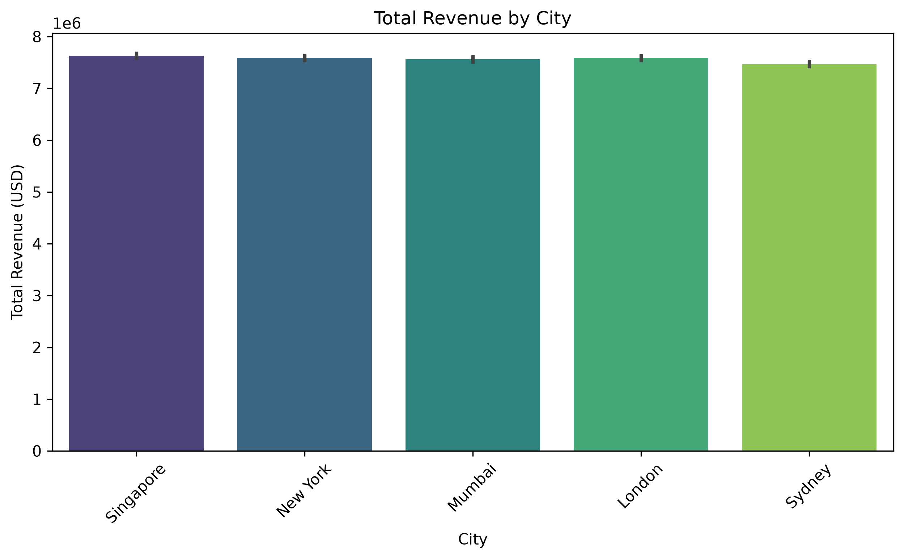
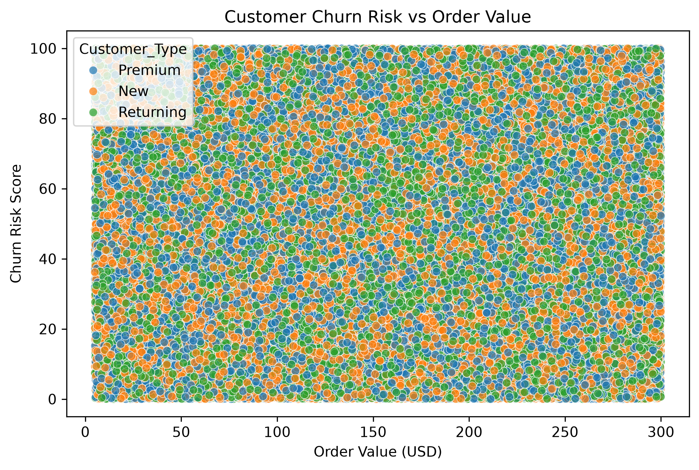

# Food Delivery Operations Analytics 🚀

An end-to-end data analysis project focusing on food delivery performance, customer churn risk, revenue insights, and delivery efficiency using Python, Pandas, SQL, and Matplotlib/Seaborn.

---

## 📌 Project Overview
This project analyzes a dataset of **250K+ records** related to food delivery operations. The objective is to extract meaningful business insights, evaluate delivery times, analyze customer behavior, and identify factors contributing to customer churn risk.

---

## 📂 Project Structure
- **`Data/`**: Contains the dataset (`Food_Delivery_Operations_Analytics.csv`) and saved visual plots.
- **`analysis.ipynb`**: Jupyter Notebook containing Exploratory Data Analysis (EDA) and visualizations.
- **`etl_pipeline.py`**: Python script handling data extraction, cleaning, and transformation.
- **`queries.sql`**: SQL queries used for business intelligence and data aggregation.

---

## 📊 Key Insights & Visualizations

1. **Food Delivery Time Distribution**
   - Analyzed the spread of delivery times in minutes to identify bottlenecks and average delivery durations.
   - 

2. **Total Revenue by City**
   - Evaluated which cities generate the highest total revenue to optimize regional operations.
   - 

3. **Customer Churn Risk vs. Order Value**
   - Examined the correlation between order values, customer types, and their respective churn risk scores.
   - 

---

## 💻 Tech Stack
- **Python** (Pandas, Matplotlib, Seaborn)
- **SQL** (Data querying and aggregation)
- **Jupyter Notebook & PyCharm** (Development Environment)

---

## 🚀 How to Run the Project
1. Clone the repository:
   ```bash
   git clone [https://github.com/areeba772/food-delivery-analytics.git](https://github.com/areeba772/food-delivery-analytics.git)